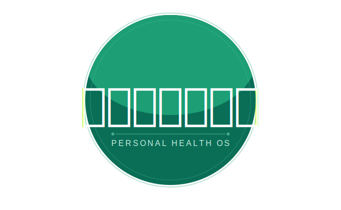

<div align="center">



<br/>


<br/>

<!-- Hackathon badge -->

&nbsp;


<br/><br/>


<br/><br/>


<br/><br/>

<p>
<a href="#-the-problem">Problem</a> ·
<a href="#-the-solution">Solution</a> ·
<a href="#-five-layers">Five Layers</a> ·
<a href="#-system-architecture">Architecture</a> ·
<a href="#-tech-stack">Stack</a> ·
<a href="#-data-models">Data Models</a> ·
<a href="#-firebase">Firebase</a> ·
<a href="#-screen-map">Screens</a> ·
<a href="#-setup">Setup</a>
</p>

</div>

---


## 🏆 Kriyeta 5.0 — Team Hexa Binary

<div align="center">

| | |
|:---:|:---:|
| **Hackathon** | Kriyeta 5.0 |
| **Team** | Hexa Binary |
| **Problem Statement** | PS2 — Medication Interaction & Expiry Tracker |
| **Track** | Healthcare Technology |
| **Platform** | Mobile (Android / iOS) + IoT Wearable + Web Emergency Endpoint |

</div>

> Sanjivani solves PS2 at its core — then extends the solution into a full Personal Health OS that makes every feature more meaningful by connecting it to everything else.

---


## 💔 The Problem

<div align="center">

</div>

<br/>

<table>
<tr>
<td width="50%" valign="top">

### The Daily Reality

An elderly person in Indore manages **7 medications** for blood pressure, diabetes, and thyroid — prescribed by 3 different specialists. Last month, her doctor added a painkiller. Nobody flagged that it reacts dangerously with her blood thinner.

She took both. Her son in Bangalore found out three days later.

**This is not a rare tragedy. This is Tuesday.**

</td>
<td width="50%" valign="top">

### Why Existing Apps Fail

| App | What it does | What it misses |
|---|---|---|
| Medisafe | Reminds you | Knows nothing about what you already take |
| ABHA | Stores records | No interaction check, no vitals, no alerts |
| Generic trackers | Logs pills | Cannot detect adverse reactions |
| **Sanjivani** | **All of the above** | **Nothing** |

</td>
</tr>
</table>

<div align="center">

```
The 3 specialists who treat Ramesh have never spoken to each other.
The pharmacist who dispenses his pills has no complete medication list.
The reminder app on his phone has no idea what he's already taking.

Every checkpoint that should have caught the dangerous combination — failed.
Not because people didn't care. Because the information was never connected.
```

</div>

---


## ✨ The Solution

<div align="center">


</div>

<br/>

<div align="center">

### One sentence: what Sanjivani does

**Sanjivani connects what you take, what your body does, and who your family needs to call — in one system, in real time.**

</div>

<br/>

<table>
<tr>
<td align="center" width="20%">

<br/><b>Scan</b>
<br/><sub>Pill bottle OCR</sub>
</td>
<td align="center" width="20%">

<br/><b>Detect</b>
<br/><sub>Drug interactions</sub>
</td>
<td align="center" width="20%">

<br/><b>Monitor</b>
<br/><sub>Live vitals (IoT)</sub>
</td>
<td align="center" width="20%">

<br/><b>Alert</b>
<br/><sub>Guardian + SOS</sub>
</td>
<td align="center" width="20%">

<br/><b>Connect</b>
<br/><sub>Emergency QR</sub>
</td>
</tr>
</table>

---


## 🧩 Five Layers

<div align="center">

```
╔══════════════════════════════════════════════════════════════════════════╗
║                         SANJIVANI PLATFORM                               ║
╠══════════════╦═══════════════╦══════════════════╦═══════════════════════╣
║  💊          ║  🏥           ║  📡              ║  🔴                   ║
║  Medication  ║  Health       ║  IoT Vitals      ║  Emergency            ║
║  Intelligence║  Resume       ║  & Safety        ║  Response             ║
╠══════════════╩═══════════════╩══════════════════╩═══════════════════════╣
║                    🌙  Cycle Intelligence (cross-cutting)                 ║
╠══════════════════════════════════════════════════════════════════════════╣
║                         Firebase Backend                                  ║
║          Firestore · Realtime DB · Cloud Functions · FCM · Auth          ║
╠══════════╦═══════════╦══════════════╦═══════════════════════════════════╣
║ RxNorm   ║ OpenFDA   ║ Jan Aushadhi ║ RAG Backend · ML Kit · Maps      ║
╚══════════╩═══════════╩══════════════╩═══════════════════════════════════╝
```

</div>

<br/>

### 💊 Layer 1 — Medication Intelligence Engine *(PS2 Core)*

> The direct answer to Problem Statement 2. Every medication flows through this pipeline.

<div align="center">

```
📷 Camera Scan
      │
      ▼
┌─────────────────────┐
│  ML Kit OCR         │  ← On-device. No image leaves the phone.
│  Extract:           │
│  Name · Dose · Qty  │
│  Expiry Date        │
└──────────┬──────────┘
           │  User edits → confirms
           ▼
┌─────────────────────┐
│  RxNorm Normalize   │  ← "Crocin" → "Paracetamol" (canonical)
│  Brand → Generic    │
│  + rxcui lookup     │
└──────────┬──────────┘
           │
           ▼
┌─────────────────────┐
│  OpenFDA Interaction│  ← New drug × every existing medication
│  Combinatorial Check│    Not a 2-drug lookup. Full graph query.
└──────────┬──────────┘
           │
     ┌─────┴──────┐
     ▼            ▼
🔴 BLOCKED    🟡 WARN        🟢 OK
Contraindicated  Acknowledge   Proceed
     │            │            │
     └────────────┴────────────┘
                  │
                  ▼
┌─────────────────────┐
│  💰 Price Compare   │  ← Jan Aushadhi + 1mg + PharmEasy
│  Jan Aushadhi price │    Shows % savings + nearest Kendra (GPS)
│  vs market price    │
└──────────┬──────────┘
           │
           ▼
┌─────────────────────┐
│  📅 Schedule Builder│  ← "Take 2 tablets twice daily after meals"
│  NLP → structured   │    NLP extracts: time, qty, food dependency
│  schedule           │
└──────────┬──────────┘
           │
     ┌─────┴──────────────┐
     ▼                    ▼
📱 Push Notification  ⌚ Mi Band Reminder
   FCM (Zomato-style)    Mi Band Notify SDK
                         + Health Connect
                         + HealthKit fallback
```

</div>

**Also includes:** Expiry alerts at 30d → 7d → 1d · Vaccination reminders (age-based Indian schedule)

---

### 🏥 Layer 2 — Health Profile & Resume

> The data backbone. Every other layer reads from it. Not a document store — a living AI-maintained health summary.

<div align="center">

| Input Source | What's Extracted | Where It Goes |
|---|---|---|
| Onboarding form | Blood type, allergies, conditions, contacts | Profile + Emergency QR |
| Uploaded reports (PDF/JPG) | Diagnoses, medications, lab values, dates | Health Resume |
| Medication inventory | Active drugs, dosages, interactions | Health Resume + RAG |
| IoT vitals history | Trends, anomalies, baseline | Health Resume + Cycle |
| Teleconsultation notes | Doctor findings, new prescriptions | Health Resume |

**The Health Resume feeds:** Emergency QR endpoint · RAG assistant context · Teleconsult AI report · Cycle Intelligence baseline

</div>

---

### 📡 Layer 3 — IoT Vitals & Safety Engine

> Patient-centric. Home-based. The feedback loop that no pure-software system can replicate.

<div align="center">

**Hardware (ESP32 wearable — separate firmware repo)**

| Sensor | Measures | Accuracy |
|---|---|---|
| MAX30102 | SpO2 + Heart Rate | ±2% SpO2 · ±3 BPM |
| DS18B20 | Body Temperature | ±0.5°C |
| MPU6050 | 6-axis IMU (fall + crash) | — |
| ESP32 Core | Wi-Fi + BLE + 240MHz | — |
| Battery | 3.7V LiPo USB-C | ~72h continuous |

</div>

<br/>

**The Innovation: Medication–Vitals Correlation**

```
                    ┌─────────────────────────────────────────┐
                    │  You added Ibuprofen at 8:00 PM         │
                    └─────────────────────────────────────────┘
                                        │
                              6 hours later...
                                        │
                                        ▼
                    ┌─────────────────────────────────────────┐
                    │  IoT patch: Heart Rate spike detected   │
                    │  HR: 147 BPM  (threshold: >150)         │
                    └─────────────────────────────────────────┘
                                        │
                              Cloud Function fires
                                        │
                                        ▼
                    ┌─────────────────────────────────────────┐
                    │  ⚠️  POSSIBLE ADVERSE REACTION           │
                    │  "Ibuprofen added 6 hrs ago"            │
                    │  "Known interaction with Warfarin"      │
                    │  → Recommend immediate consultation     │
                    └─────────────────────────────────────────┘
                                        │
                            No other consumer app does this.
```

**Fall & Crash Detection Flow:**

```
MPU6050 detects event (firmware)
    │
    ├── Fall:  >3G spike + horizontal orientation >3s
    └── Crash: >4G deceleration + GPS velocity drop

    ▼
30-second cancel window (patient can dismiss false positive)
    │
    ├── Cancelled → false alarm logged
    └── Timeout  → SOS ACTIVATED
                      │
        ┌─────────────┼─────────────┬─────────────────┐
        ▼             ▼             ▼                  ▼
  Guardian      Emergency QR   Live vitals      Doctor Health
  push + GPS    live vitals    stream to        Map → Book
  location      appended       guardian         teleconsult
```

---

### 🔴 Layer 4 — Emergency Response

> The feature that works when everything else fails.

<div align="center">

```
┌──────────────────────────────────────────────────┐
│              EMERGENCY QR ENDPOINT                │
│                                                   │
│  ✓ Accessible from lock screen — no unlock needed │
│  ✓ Public HTTPS URL — no app, no login, no JS     │
│  ✓ Loads in <2 seconds on 3G                      │
│  ✓ Displays: Blood type · Allergies · Meds        │
│              Conditions · Emergency contacts      │
│  ✓ SOS mode: Live vitals appended automatically   │
│  ✓ Token revocable + regeneratable at any time    │
└──────────────────────────────────────────────────┘
```

**Guardian Teleconsultation Flow** — triggered automatically on anomaly:

```
Anomaly Alert
    │
    ▼
Guardian receives push notification
    │
    ▼
"Book Teleconsultation" CTA in notification
    │
    ▼
Doctor Health Map — geo-filtered by anomaly type / specialty
    │
    ▼
Booking confirmed → AI report auto-generated from Health Resume
    │
    ▼
Doctor receives report BEFORE the call begins
    │
    ▼
Post-call: notes + prescriptions → Health Resume (auto-ingested)
```

</div>

---

### 🌙 Layer 5 — Cycle Intelligence

> A vitals-aware menstrual health module. Connects IoT physiological data with cycle phases to surface patterns no period tracker ever could.

<div align="center">

| Phase | Avg Days | What Sanjivani Monitors |
|:---:|:---:|---|
| 🔴 Menstruation | 1–5 | SpO2 dips, elevated HR, temperature baseline |
| 🟢 Follicular | 6–13 | Temperature normalization, HR variability |
| 🟡 Ovulation | ~14 | BBT spike 0.2–0.5°C, HR pattern shift |
| 🟣 Luteal | 15–28 | Sustained temp elevation, SpO2 patterns |

</div>

**Cross-system integration:**

```
Cycle Phase (current)
    ├── → IoT vitals are compared against phase-expected ranges
    ├── → Medication history checked for cycle-affecting drugs
    │       (NSAIDs affect BBT · hormonal meds affect regularity)
    ├── → Health Resume provides diagnosed conditions context
    │       (thyroid · diabetes · PCOS history)
    └── → RAG assistant answers in cycle context
            "Is my temperature normal this week?" → phase-aware answer

Pattern Engine flags:
    ├── Irregular cycle length
    ├── Unexpected BBT spike / drop
    ├── Elevated HR across phases
    ├── Low SpO2 pattern
    ├── Possible PCOS signal (informational only — not a diagnosis)
    └── Medication affecting cycle regularity
```

> ⚠️ This feature provides informational pattern signals only. It explicitly does not replace medical diagnosis. All insights include a consultation prompt.

---


## 🏗 System Architecture

<div align="center">

```
                        ┌─────────────────────────────────────┐
                        │            MOBILE APP               │
                        │     React Native · Expo · TypeScript │
                        └──────────────────┬──────────────────┘
                                           │
              ┌────────────────────────────┼──────────────────────────┐
              │                            │                          │
              ▼                            ▼                          ▼
   ┌──────────────────┐      ┌─────────────────────┐    ┌────────────────────┐
   │  DRUG INTEL APIs │      │   FIREBASE BACKEND  │    │   IOT PATCH        │
   │                  │      │                     │    │   (separate repo)  │
   │ • RxNorm (NLM)   │      │ • Firestore         │    │                    │
   │ • OpenFDA        │◄────►│ • Realtime Database │◄───│ ESP32 + sensors    │
   │ • Jan Aushadhi   │      │ • Cloud Functions   │    │ MAX30102 (SpO2/HR) │
   │ • 1mg / PharmEasy│      │ • FCM notifications │    │ MPU6050 (IMU)      │
   └──────────────────┘      │ • Firebase Auth     │    │ DS18B20 (Temp)     │
                             └──────────┬──────────┘    └────────────────────┘
                                        │
              ┌─────────────────────────┼──────────────────────────┐
              │                         │                          │
              ▼                         ▼                          ▼
   ┌──────────────────┐    ┌────────────────────────┐  ┌─────────────────────┐
   │   RAG BACKEND    │    │  EMERGENCY WEB ENDPOINT │  │   WEARABLE LAYER    │
   │   (separate)     │    │  Next.js (separate repo)│  │                     │
   │                  │    │                        │  │ Mi Band Notify SDK  │
   │ LLM + FAISS      │    │ Public · No login      │  │ Health Connect (RN) │
   │ Vector store     │    │ No JS · <2s on 3G      │  │ HealthKit (iOS)     │
   │ Medical KB       │    │ Serves QR endpoint     │  └─────────────────────┘
   └──────────────────┘    └────────────────────────┘
```

</div>

### Complete Data Flow

<div align="center">

```
USER ACTION                PROCESSING                     OUTCOME
─────────────────────────────────────────────────────────────────────────────
Scan pill bottle      →  ML Kit OCR (on-device)       →  Name · Dose · Expiry
                      →  RxNorm normalize              →  Canonical drug name
                      →  OpenFDA interact check        →  🔴🟡🟢 Severity flag
                      →  Jan Aushadhi lookup           →  Price + nearest Kendra
                      →  NLP schedule parse            →  Daily reminder schedule
                      →  Firebase write                →  Inventory + Health Resume
                      →  FCM + Mi Band push            →  Wearable reminder

IoT patch reads       →  Firebase RTDB write (30s)     →  Guardian dashboard live
                      →  Cloud Function onWrite        →  Anomaly check
                      →  Threshold breached?
                          YES → Push alert             →  Patient + guardian notified
                              → Med correlation        →  Adverse reaction flag
                              → Critical?
                                  YES → SOS mode       →  Live vitals on QR endpoint
                                      → GPS share      →  Guardian + emergency contacts
                                      → Doctor map     →  Teleconsult booking

QR scan (bystander)   →  HTTPS request (no auth)       →  Blood type · Allergies · Meds
                      →  Static render (no JS)         →  Emergency contacts · Live vitals*
                      (* only in SOS mode)
```

</div>

---


## ⚙️ Tech Stack

<div align="center">


<br/><br/>

| Category | Technology | Why |
|---|---|---|
| **Framework** | React Native 0.74 + Expo SDK 51 | Cross-platform, OTA updates, Expo ecosystem |
| **Language** | TypeScript (strict) | Zero `any`, compile-time safety |
| **Navigation** | Expo Router v3 | File-based routing, deep linking, web parity |
| **Global State** | Zustand | Minimal, no boilerplate, async-friendly |
| **Server State** | TanStack React Query | Caching, background refetch, optimistic updates |
| **Styling** | NativeWind v4 | Tailwind DX on native, no StyleSheet.create |
| **Animations** | Reanimated v3 | Worklet-based, 60fps on JS thread |
| **OCR** | Google ML Kit Text Recognition | On-device, zero network, handles Devanagari |
| **Drug Data** | RxNorm (NLM) + OpenFDA | Free, authoritative, pharmacopoeial standard |
| **Prices** | Jan Aushadhi dataset + 1mg + PharmEasy | Government + private market coverage |
| **Voice** | Expo Speech + @react-native-voice | Hindi + English STT/TTS |
| **Wearable** | Mi Band SDK + Health Connect + HealthKit | Primary Mi Band + universal fallback |
| **Maps** | React Native Maps + Expo Location | Doctor health map + nearest Kendra |
| **Forms** | React Hook Form + Zod | Schema-validated, zero re-renders |
| **Backend** | Firebase (Firestore + RTDB + Functions) | Real-time, scalable, low ops overhead |
| **Auth** | Firebase Auth (OTP + Google) | India-first OTP flow |
| **Notifications** | FCM + APNs | Android + iOS push |
| **Testing** | Jest + RNTL | Unit + integration |
| **Package Manager** | `pnpm` | Faster, disk-efficient |

</div>

---


## 📁 Repository Structure

```
sanjivani/
│
├── app/                                    # Expo Router — file-based routing
│   ├── (auth)/                             # Unauthenticated flow
│   │   ├── welcome.tsx
│   │   ├── login.tsx
│   │   └── onboarding/
│   │       ├── personal.tsx               # Step 1: name, DOB, blood type, sex
│   │       ├── medical.tsx                # Step 2: allergies, conditions
│   │       ├── documents.tsx              # Step 3: upload documents
│   │       └── role.tsx                   # Step 4: patient or guardian
│   │
│   ├── (tabs)/                            # Main authenticated navigation
│   │   ├── _layout.tsx
│   │   ├── home.tsx                       # Dashboard — summary cards
│   │   ├── medications.tsx                # Medication inventory
│   │   ├── vitals.tsx                     # IoT vitals + trend charts
│   │   ├── cycle.tsx                      # Cycle Intelligence (female only)
│   │   ├── profile.tsx                    # Health Resume + documents
│   │   └── assistant.tsx                  # Voice RAG assistant
│   │
│   ├── medication/
│   │   ├── scan.tsx                       # Camera OCR scan
│   │   ├── confirm.tsx                    # OCR result edit form
│   │   ├── interactions.tsx               # Drug interaction result
│   │   ├── price-compare.tsx              # Jan Aushadhi + market prices
│   │   └── schedule.tsx                   # Dosage schedule builder
│   │
│   ├── cycle/
│   │   ├── log.tsx                        # Log period + symptoms
│   │   ├── insights.tsx                   # Pattern flags + explanations
│   │   └── history.tsx                    # Full cycle calendar
│   │
│   ├── emergency/
│   │   ├── sos.tsx                        # 30-second SOS countdown
│   │   ├── qr.tsx                         # Emergency QR display + token
│   │   └── doctor-map.tsx                 # Doctor map + teleconsult booking
│   │
│   ├── guardian/
│   │   ├── dashboard.tsx                  # Remote vitals view
│   │   └── alerts.tsx                     # Alert history
│   │
│   └── _layout.tsx                        # Root layout + auth gate
│
├── components/
│   ├── ui/                                # Base design system
│   │   ├── Button.tsx
│   │   ├── Card.tsx
│   │   ├── Badge.tsx
│   │   ├── Input.tsx
│   │   ├── Modal.tsx
│   │   ├── Toast.tsx
│   │   └── Typography.tsx
│   │
│   ├── medication/
│   │   ├── MedicationCard.tsx
│   │   ├── InteractionFlag.tsx            # 🔴🟡🟢 severity badge
│   │   ├── PriceCompareCard.tsx
│   │   └── DoseScheduleRow.tsx
│   │
│   ├── vitals/
│   │   ├── VitalsRing.tsx                 # Animated SpO2/HR ring
│   │   ├── VitalsChart.tsx                # 24h/7d/30d trend graph
│   │   └── AnomalyAlert.tsx
│   │
│   ├── cycle/
│   │   ├── CycleCalendar.tsx              # Phase-colored calendar
│   │   ├── PhaseIndicator.tsx             # Current phase banner
│   │   ├── VitalsCycleOverlay.tsx         # Vitals overlaid on cycle
│   │   └── CycleFlag.tsx                  # Irregular pattern alert
│   │
│   ├── emergency/
│   │   ├── QRWidget.tsx                   # Lock screen QR
│   │   └── SOSCountdown.tsx               # 30-second animated timer
│   │
│   └── shared/
│       ├── ElderlyMode.tsx                # Font/touch target wrapper
│       └── LanguageProvider.tsx
│
├── hooks/
│   ├── useMedications.ts
│   ├── useVitals.ts
│   ├── useCycle.ts
│   ├── useEmergency.ts
│   ├── useHealthResume.ts
│   ├── useInteractionCheck.ts
│   ├── usePriceCompare.ts
│   └── useVoice.ts
│
├── stores/
│   ├── authStore.ts
│   ├── medicationStore.ts
│   ├── vitalsStore.ts
│   ├── cycleStore.ts
│   └── emergencyStore.ts
│
├── services/
│   ├── firebase/
│   │   ├── auth.ts
│   │   ├── firestore.ts
│   │   ├── realtimeDb.ts
│   │   └── fcm.ts
│   ├── ocr/
│   │   └── pillScanner.ts
│   ├── drugs/
│   │   ├── rxnorm.ts
│   │   ├── openFda.ts
│   │   └── priceCompare.ts
│   ├── cycle/
│   │   ├── phaseCalculator.ts
│   │   ├── patternEngine.ts
│   │   └── medicationCorrelator.ts
│   ├── rag/
│   │   └── assistant.ts
│   └── wearable/
│       └── healthConnect.ts
│
├── types/
│   ├── medication.ts
│   ├── vitals.ts
│   ├── cycle.ts
│   ├── user.ts
│   └── emergency.ts
│
├── constants/
│   ├── colors.ts
│   ├── typography.ts
│   ├── thresholds.ts
│   └── languages.ts
│
├── utils/
│   ├── dosageParser.ts
│   ├── interactionClassifier.ts
│   ├── cyclePhaseUtils.ts
│   ├── healthResumeBuilder.ts
│   └── dateHelpers.ts
│
├── i18n/
│   ├── en.json
│   ├── hi.json
│   └── index.ts
│
├── assets/
│   └── logo.png
│
├── .env.example
├── app.json
├── babel.config.js
├── tailwind.config.js
└── tsconfig.json
```

---


## 🗃 Data Models

> Use these types exactly as defined. All types live in `/types/`. Do not rename fields.

<details>
<summary><b>UserProfile</b></summary>

```typescript
export interface UserProfile {
  uid: string
  name: string
  dateOfBirth: string                         // ISO 8601
  bloodType: 'A+' | 'A-' | 'B+' | 'B-' | 'AB+' | 'AB-' | 'O+' | 'O-' | 'Unknown'
  heightCm: number
  weightKg: number
  sex: 'male' | 'female' | 'other' | 'prefer_not_to_say'
  allergies: string[]
  chronicConditions: string[]
  emergencyContacts: Array<{
    name: string; relation: string; phone: string; isPrimary: boolean
  }>
  role: 'patient' | 'guardian'
  guardianOf?: string                         // uid of patient
  elderlyMode: boolean
  preferredLanguage: 'en' | 'hi' | 'mr' | 'bn' | 'ta'
  qrToken: string                             // UUID v4
  createdAt: Timestamp
  updatedAt: Timestamp
}
```
</details>

<details>
<summary><b>Medication</b></summary>

```typescript
export interface Medication {
  id: string
  uid: string
  brandName: string                           // OCR extracted
  genericName: string                         // RxNorm normalized
  rxcui: string
  dosage: string
  quantity: number
  expiryDate: string                          // ISO 8601
  schedule: Array<{
    time: string                              // "HH:MM" 24-hour
    quantity: number
    unit: string                              // "tablet" | "ml" | "drop"
    withFood: boolean
    notes?: string
  }>
  status: 'active' | 'archived' | 'expired'
  addedAt: Timestamp
  interactionLog: Array<{
    checkedAt: Timestamp
    interactingDrugId: string
    interactingDrugName: string
    severity: 'contraindicated' | 'major' | 'minor' | 'none'
    description: string
    source: 'openfda' | 'rxnorm'
  }>
  janAushadhiEquivalent?: {
    productId: string; productName: string; mrp: number
    marketPrice: number; savingsPercent: number
    nearestKendra?: { name: string; address: string; distanceKm: number }
  }
  affectsCycle?: boolean
  cycleBBTEffect?: 'raises' | 'lowers' | 'unpredictable' | null
}
```
</details>

<details>
<summary><b>VitalsReading + AnomalyEvent</b></summary>

```typescript
export interface VitalsReading {
  id: string; uid: string; timestamp: Timestamp
  spo2: number        // 0–100%
  heartRate: number   // BPM
  temperature: number // Celsius
  source: 'iot_patch' | 'manual'
}

export interface AnomalyEvent {
  id: string; uid: string; timestamp: Timestamp
  type: 'spo2_low' | 'hr_high' | 'hr_low' | 'temp_high' | 'fall' | 'crash'
  vitalsAtEvent: VitalsReading
  medicationCorrelation?: {
    medicationId: string; medicationName: string
    addedHoursAgo: number; flag: string
  }
  cyclePhaseAtEvent?: CyclePhase
  resolved: boolean; resolvedAt?: Timestamp
}

// Thresholds (constants/thresholds.ts)
export const VITALS_THRESHOLDS = {
  spo2Low: 90, hrLow: 45, hrHigh: 150, tempHigh: 38.5
} as const
```
</details>

<details>
<summary><b>Cycle Intelligence</b></summary>

```typescript
export type CyclePhase = 'menstruation' | 'follicular' | 'ovulation' | 'luteal'

export type CycleFlagType =
  | 'irregular_cycle_length'   | 'unexpected_bbt_spike'
  | 'unexpected_bbt_drop'      | 'elevated_hr_across_phases'
  | 'low_spo2_pattern'         | 'possible_pcos_signal'
  | 'possible_hormonal_imbalance' | 'medication_affecting_cycle'

export interface CycleEntry {
  id: string; uid: string; date: string; phase: CyclePhase; dayOfCycle: number
  userLogged: {
    flow?: 'none' | 'spotting' | 'light' | 'medium' | 'heavy'
    symptoms?: string[]; mood?: string; notes?: string
  }
  vitalsCorrelated: {
    bbt: number; hrAvg: number; spo2Avg: number
    source: 'iot_patch' | 'manual' | 'estimated'
  }
  flags: Array<{
    type: CycleFlagType; severity: 'info' | 'watch' | 'consult'
    description: string; relatedMedication?: string; detectedAt: Timestamp
  }>
}
```
</details>

<details>
<summary><b>Emergency</b></summary>

```typescript
export interface EmergencySummary {
  // Public QR endpoint — readable by anyone who scans
  name: string; bloodType: string; allergies: string[]
  activeMedications: Array<{ genericName: string; dosage: string }>
  chronicConditions: string[]
  emergencyContacts: Array<{ name: string; relation: string; phone: string }>
  liveVitals?: VitalsReading    // SOS mode only
  lastUpdated: string
}

export interface SOSEvent {
  id: string; uid: string; triggeredAt: Timestamp
  triggerType: 'manual' | 'fall' | 'crash' | 'vitals_critical'
  location?: { latitude: number; longitude: number; accuracy: number }
  cancelledAt?: Timestamp; cancelled: boolean
}
```
</details>

---


## 🔥 Firebase Architecture

### Firestore Collections

```
users/{uid}                                  UserProfile
users/{uid}/medications/{id}                 Medication
users/{uid}/documents/{id}                   { name, url, uploadedAt, parsedFields }
users/{uid}/anomaly_log/{id}                 AnomalyEvent
users/{uid}/sos_events/{id}                  SOSEvent
users/{uid}/teleconsultations/{id}           { doctorName, bookedAt, report, notes }
users/{uid}/cycle/{id}                       CycleEntry
users/{uid}/cycle_summary                    CycleSummary (single doc, overwritten)
emergency/{qrToken}                          EmergencySummary
  └── Security: read=public · write=auth only
```

### Realtime Database (IoT vitals stream)

```
/vitals/{uid}/current          Latest reading (overwritten every 30s by IoT patch)
/vitals/{uid}/stream/{ts}      Individual readings during SOS mode only
```

### Security Rules

| Path | Read | Write |
|---|---|---|
| `users/{uid}/**` | uid == auth OR guardian | uid == auth |
| `emergency/{token}` | **Public** | Authenticated |
| `/vitals/{uid}/**` | uid == auth OR guardian | IoT service account |

---


## 🗺 Screen Map

```
Root _layout.tsx
│
├── (auth) — not authenticated
│   ├── /welcome
│   ├── /login
│   └── /onboarding/ (linear — no skipping)
│       ├── personal → medical → documents → role
│
└── (tabs) — authenticated
    ├── Tab: home          Dashboard (default for patient)
    ├── Tab: medications   Inventory
    ├── Tab: vitals        IoT display (default for guardian)
    ├── Tab: cycle         Cycle Intel (hidden if sex = 'male')
    ├── Tab: profile       Health Resume
    └── Tab: assistant     Voice RAG
    │
    └── Modals (programmatic only for SOS):
        ├── /medication/scan · confirm · interactions · price-compare · schedule
        ├── /cycle/log · insights · history
        ├── /emergency/sos      ← PROGRAMMATIC ONLY — never direct router.push
        ├── /emergency/qr · doctor-map
        └── /guardian/dashboard · alerts
```

---


## 🔌 API Reference

<details>
<summary><b>RxNorm — Drug Normalization</b></summary>

```
Base:  https://rxnav.nlm.nih.gov/REST
Auth:  None

Normalize:   GET /drugs.json?name={drugName}
             → .drugGroup.conceptGroup[].conceptProperties[].rxcui + .name

Properties:  GET /rxcui/{rxcui}/allProperties.json?prop=names
```
</details>

<details>
<summary><b>OpenFDA — Drug Interactions</b></summary>

```
Base:  https://api.fda.gov/drug
Auth:  None (basic queries)

Check: GET /label.json?search=drug_interactions:{genericName}&limit=5
       → .results[].drug_interactions[]

Severity classified in: services/drugs/openFda.ts → utils/interactionClassifier.ts
Output: 'contraindicated' | 'major' | 'minor' | 'none'
```
</details>

<details>
<summary><b>RAG Assistant</b></summary>

```
POST {EXPO_PUBLIC_RAG_API_URL}/query
Authorization: Bearer {EXPO_PUBLIC_RAG_API_KEY}
Content-Type: application/json

{
  "query": "string",
  "language": "en | hi | mr | bn | ta",
  "context": {
    "medications": ["string"],
    "allergies": ["string"],
    "conditions": ["string"],
    "cyclePhase": "CyclePhase | undefined"
  }
}

→ { "answer": "string", "disclaimer": "string", "sources": ["string"] }
```
</details>

---


## 🛠 Setup

```bash
# Clone
git clone https://github.com/hexa-binary/sanjivani-app
cd sanjivani-app

# Install — pnpm only
pnpm install

# Environment
cp .env.example .env.local
# Fill in all EXPO_PUBLIC_ values

# Start
pnpm expo start

# Platform specific
pnpm expo run:android
pnpm expo run:ios
```

### `.env.example`

```env
EXPO_PUBLIC_FIREBASE_API_KEY=
EXPO_PUBLIC_FIREBASE_AUTH_DOMAIN=
EXPO_PUBLIC_FIREBASE_PROJECT_ID=
EXPO_PUBLIC_FIREBASE_STORAGE_BUCKET=
EXPO_PUBLIC_FIREBASE_MESSAGING_SENDER_ID=
EXPO_PUBLIC_FIREBASE_APP_ID=
EXPO_PUBLIC_FIREBASE_RTDB_URL=

EXPO_PUBLIC_RXNORM_BASE_URL=https://rxnav.nlm.nih.gov/REST
EXPO_PUBLIC_OPENFDA_BASE_URL=https://api.fda.gov/drug
EXPO_PUBLIC_PHARMAEASY_API_KEY=
EXPO_PUBLIC_ONEMG_API_KEY=
EXPO_PUBLIC_JAN_AUSHADHI_DATASET_URL=

EXPO_PUBLIC_RAG_API_URL=
EXPO_PUBLIC_RAG_API_KEY=
EXPO_PUBLIC_GOOGLE_MAPS_API_KEY=
```

---


## 📐 Conventions

| Rule | Detail |
|---|---|
| TypeScript | Strict — zero `any` · zero `@ts-ignore` |
| Components | Functional only · One per file · Props exported |
| Styling | NativeWind only — no `StyleSheet.create` |
| Data fetching | React Query for APIs · Firebase `onSnapshot` in hooks only |
| Firebase | All calls through `/services/firebase/` — never import SDK in components |
| OCR | On-device only — never send pill images to a server |
| Vitals | Read-only — IoT patch writes, this app reads |
| i18n | No hardcoded strings — all in `en.json` + `hi.json` |
| Errors | All errors → Toast — no silent failures — always show retry |
| Accessibility | `accessibilityLabel` + `accessibilityRole` on every touchable |
| Elderly Mode | Every component must support `elderlyMode` prop |
| SOS screen | Most tested, most accessible screen in the app |
| Naming | Components=PascalCase · Screens=kebab-case · Hooks/Services=camelCase |
| Packages | Do not add dependencies not in the stack without flagging |

---


## 🚫 Out of Scope (this repo)

| Item | Where |
|---|---|
| Emergency QR public web page | Separate Next.js repo |
| Firebase Cloud Functions | Separate functions repo |
| ESP32 IoT firmware | Separate C/Arduino repo |
| Doctor-facing portal | Future web app |
| In-app video call | Third-party SDK — not scoped |
| ABHA health ID integration | v2.0 |
| Admin dashboard | Not planned |

---


<div align="center">


<br/>

*Built for the 230 million who deserve a system that actually connects the dots.*

<br/>


&nbsp;


<br/><br/>

**संजीवनी · Sanjivani** &nbsp;·&nbsp; Personal Health OS &nbsp;·&nbsp; v2.0 &nbsp;·&nbsp; April 2026

</div>
